# 7 Round Tabata Abs and Arms Workout

## Round 1: Abs Focus

**Bicycle Crunches:**  

**Leg Raises:**  
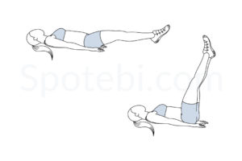

## Round 2: Arms Focus

**Push-Ups:**  

**Tricep Dips:**  
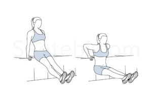

## Round 3: Abs and Arms Combo

**Commando:**  

**Russian Twists:**  
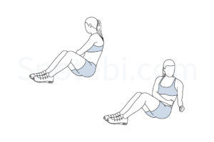

## Round 4: Abs Focus

**Flutter Kicks:**  
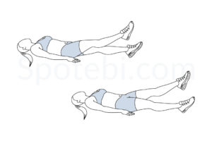

**Sit-Ups:**   
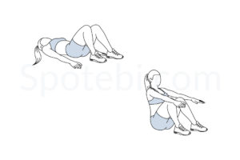

## Round 5: Arms Focus

**Mountain Climbers:**  
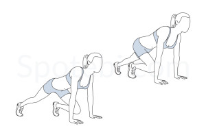

**Bicep Curls:**   
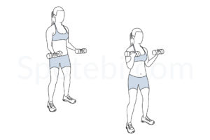

## Round 6: Abs and Arms Combo

**Plank Shoulder Taps:**    
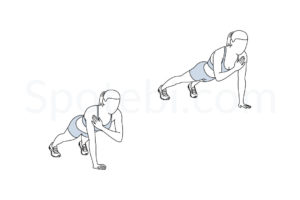

**Superman Hold:**  
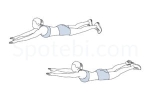

## Round 7: Abs and Arms Burnout

**Burpees with Jump:**    
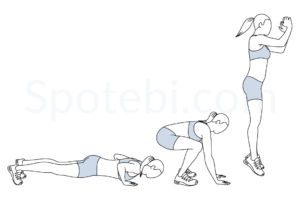

**Squat Side Kick:**    
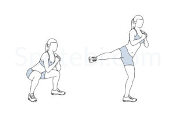
