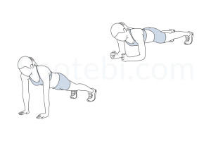

# 7 Round Tabata Abs and Arms Workout

## Round 1: Abs Focus

**Bicycle Crunches:**  

**Leg Raises:**  

## Round 2: Arms Focus

**Push-Ups:**  

**Tricep Dips:**  

## Round 3: Abs and Arms Combo

**Commando:**  

**Russian Twists:**  

## Round 4: Abs Focus

**Flutter Kicks:**  

**Sit-Ups:**   

## Round 5: Arms Focus

**Mountain Climbers:**  

**Bicep Curls:**   

## Round 6: Abs and Arms Combo

**Plank Shoulder Taps:**    

**Superman Hold:**  

## Round 7: Abs and Arms Burnout

**Burpees with Jump:**    

**Squat Side Kick:**    

