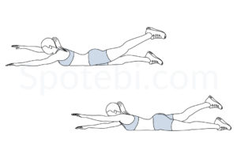
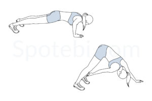
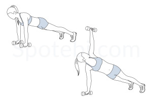
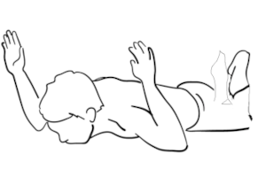
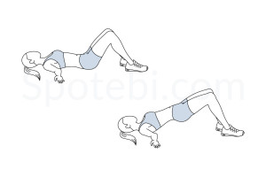
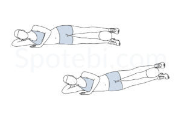

# Tabata Workout with Back, Abs, and Arms Focus

## Round 1: Back and Abs

| **Alternating Superman**                 | **Bicycle Crunches**    |
| ---------------------------- | ----------------------- |
|  |  |

---

## Round 2: Back and Arms

| **Ankle Taps**   | **Around the Worlds**            |
| ---------------------------- | ----------------------- |
|   |  |

---

## Round 3: Back and Core

| **Plank Rotation**           | **Nicoles Prone Rotation**            |
| ---------------------------- | ----------------------- |
|  |  |

---

## Round 4: Back and Arms

| **Glute Bridge**     | **Tricep Dips**         |
| ---------------------------- | ----------------------- |
|  |  |

---

## Round 5: Back and Legs

| **Hostage**              | **Superman Twist**      |
| ---------------------------- | ----------------------- |
|  |  |

---

## Round 6: Core and Back

| **Russian Twists**           | **Plank Shoulder Tap**  |
| ---------------------------- | ----------------------- |
|  |  |

---

## Round 7: Back and Arms Burnout

| **Inner Thigh Squeeze and Lift**         | **Skaters** |
| ---------------------------- | ------------------------------- |
|  |  |
