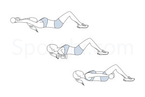
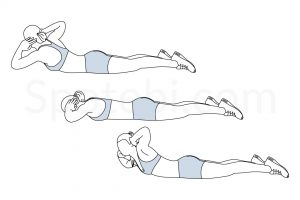

# Tabata Workout with Back, Abs, and Arms Focus

## Round 1: Back and Abs

| **Alternating Superman**      | **Bicycle Crunches**    |
| ----------------------------- | ----------------------- |
|  |  |

---

## Round 2: Arms and Full Body

| **Ankle Tap Push-Ups**        | **Around the Worlds**   |
| ----------------------------- | ----------------------- |
|   |  |

---

## Round 3: Core and Back Mobility

| **Plank Rotation**            | **Nicole's Prone Rotation** |
| ----------------------------- | -------------------------- |
|  |  |

---

## Round 4: Glutes and Arms

| **Glute Bridge**              | **Tricep Dips**         |
| ----------------------------- | ----------------------- |
|  |  |

---

## Round 5: Back and Lower Body

| **Hostage**                   | **Superman Twist**      |
| ----------------------------- | ----------------------- |
|  |  |

---

## Round 6: Core Stabilization

| **Russian Twists**            | **Plank Shoulder Tap**  |
| ----------------------------- | ----------------------- |
|  |  |

---

## Round 7: Lower Body and Full Body Burnout

| **Inner Thigh Squeeze and Lift** | **Skaters**           |
| -------------------------------- | ---------------------- |
|  |  |
