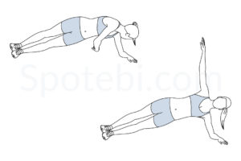
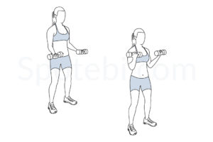

# 3x3 Round Core and Abs Workout

## Instructions
- Each exercise is performed for **45 seconds**, followed by a **10-second break**.
- Complete 3 exercises per round, repeated **3 times**.
- Take a **1-minute break** between rounds.

---

## Round 1: Core Stability and Control

| Exercise                     | Description                                       | Image                                                   |
| ---------------------------- | ------------------------------------------------- | ------------------------------------------------------- |
| **Ankle Tap & Pushup**      | Ankle Tap (optionally with push up)     |  |
| **Flutter Kicks**            | Lie on your back, flutter your legs.              |            |
| **Side Plank Rotation**      | Rotate under your torso while holding a side plank SWITCH AFTER 20s|  |

---

## Round 2: Dynamic Core Engagement

| Exercise                     | Description                                       | Image                                                   |
| ---------------------------- | ------------------------------------------------- | ------------------------------------------------------- |
| **Russian Twists**           | Twist your torso side-to-side with feet raised.   |           |
| **Mountain Climbers**        | Drive knees toward your chest in a plank.         |    |
| **Plank with Feet Lift**     | Lift one foot off the ground alternately in a plank position. |  |

---

## Round 3: Core Strength and Obliques

| Exercise                     | Description                                       | Image                                                   |
| ---------------------------- | ------------------------------------------------- | ------------------------------------------------------- |
| **Bicycle Crunches**         | Alternate touching elbows to opposite knees.      |      |
| **Alternating superman**           | Superman position, lift arms and legs alternately        |          |
| **Bicep curls**           | 3 fold: low, above head, behind head   |          |

---

### Timing Summary
1. Each exercise: **45 seconds work**, **10 seconds rest**.
2. Repeat all 3 exercises in a round **3 times**.
3. Rest **1 minute** between rounds.

