# 2025 - 01 - 11 : Full-Body 3x3x3 Workout 

## Warm Up

| Exercise                     | Description                                       | Image                                                   |
| ---------------------------- | ------------------------------------------------- | ------------------------------------------------------- |
| **Arm Circles**              | Circle arms, start small, grow larger; switch side  | 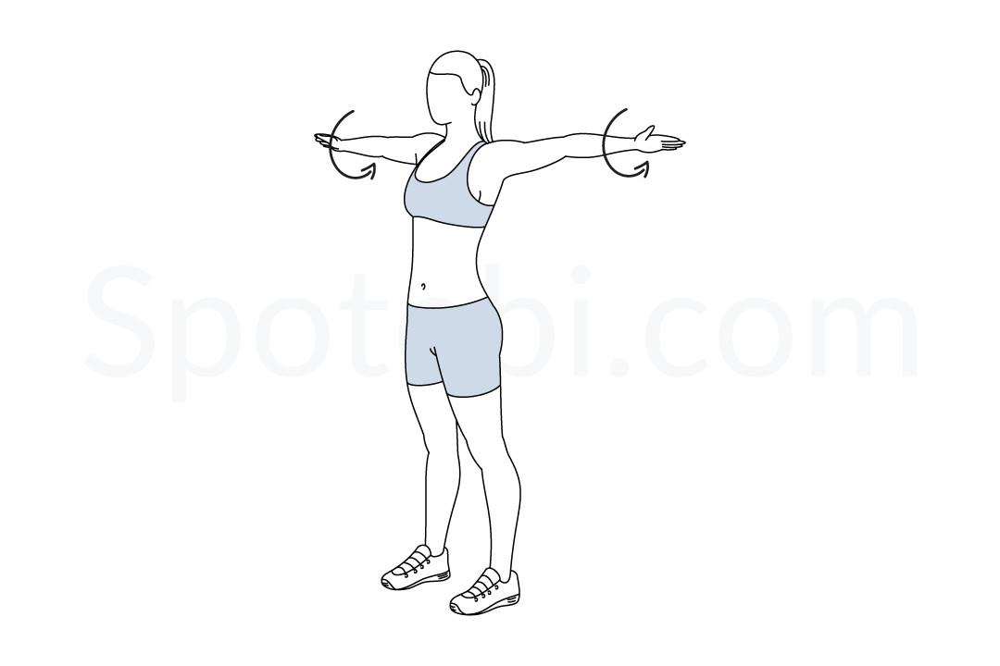 |
| **Hip Circles**              | Warm up hips                                       | 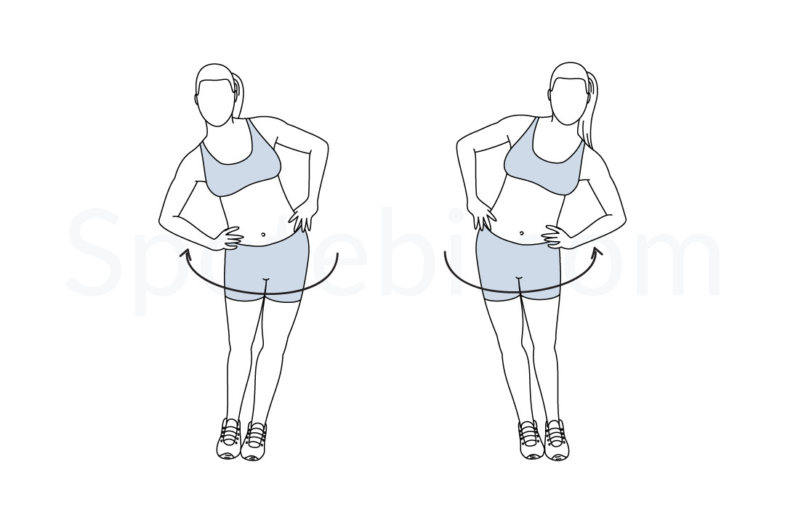 |
| **Bent Over Twist**          | Start, go to one foot, up, then to the other       | 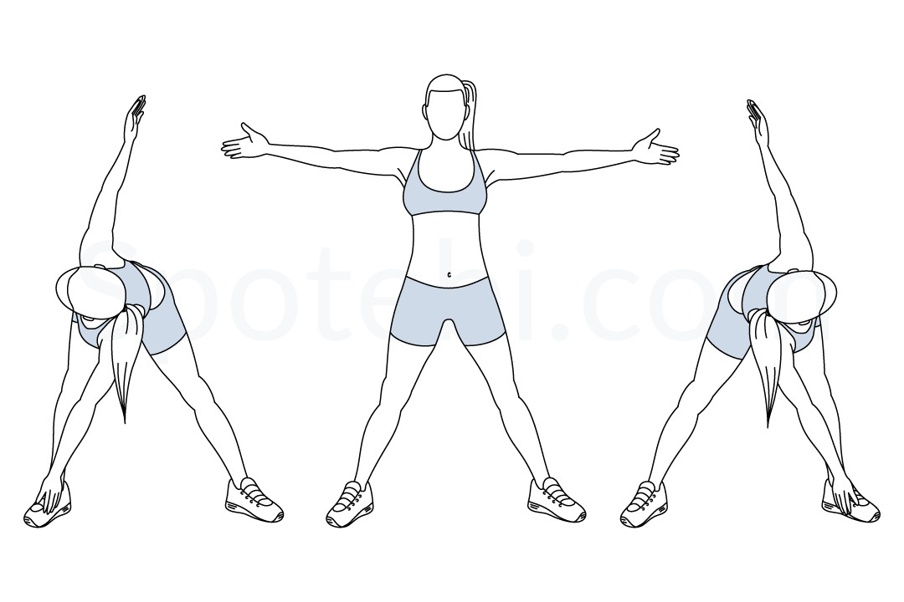 |
| **Neck Rolls**               | Warm up neck                                       | 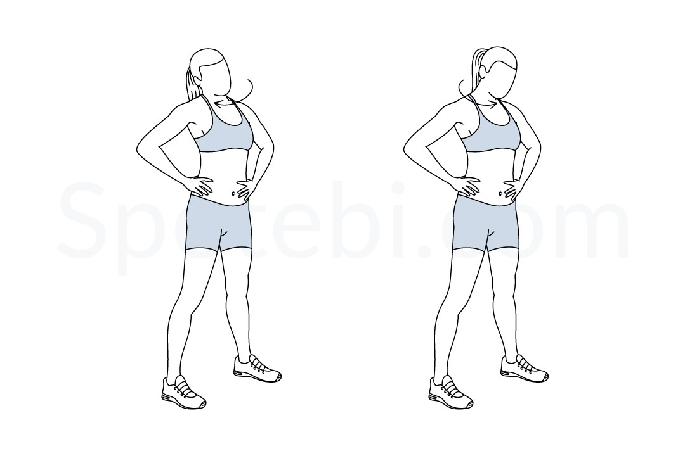 |
| **Shoulder Rolls**           | Warm up shoulders                                  | 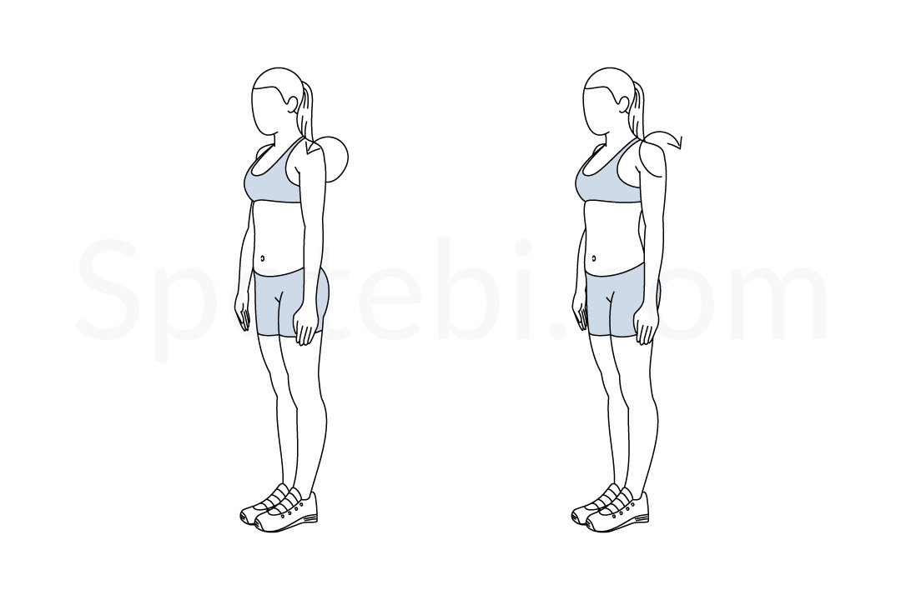 |
| **High Knees**               | Run in place, driving knees as high as possible.   | 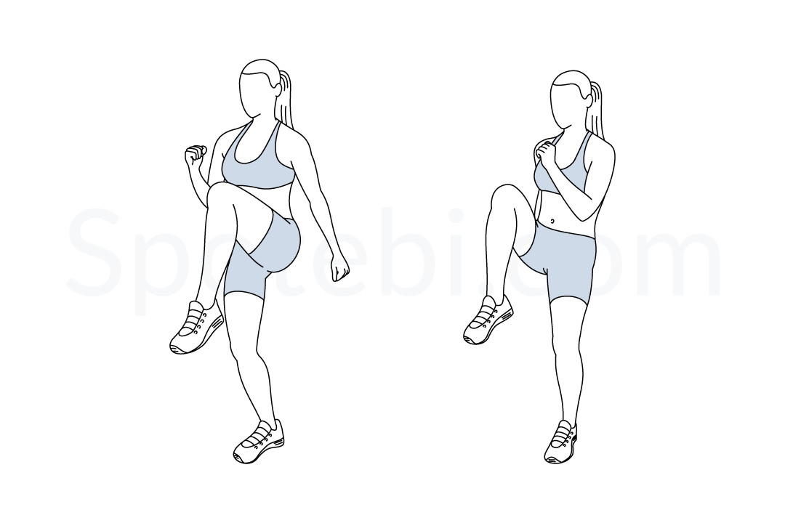 |

---

## Instructions
- Perform **3 exercises** per round.
- Complete each exercise for **45 seconds**, followed by a **10-second rest**.
- Repeat each round **3 times**.
- Take a **1-minute rest** between rounds.

---

## Round 1: 

| Exercise                     | Description                                       | Image                                                   |
| ---------------------------- | ------------------------------------------------- | ------------------------------------------------------- |
| **Side Lunge Curl**          | Side Lunge with weights, lift them when on side (different to picture), switch side after each | 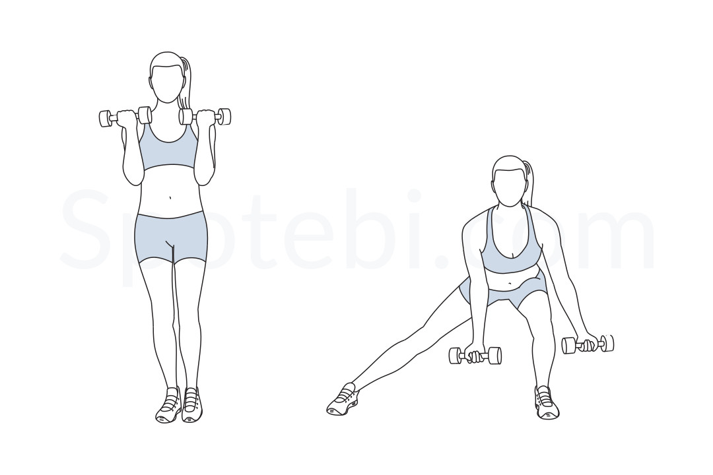 |
| **Knee Hugs**                | Without touching floor with feet                  | 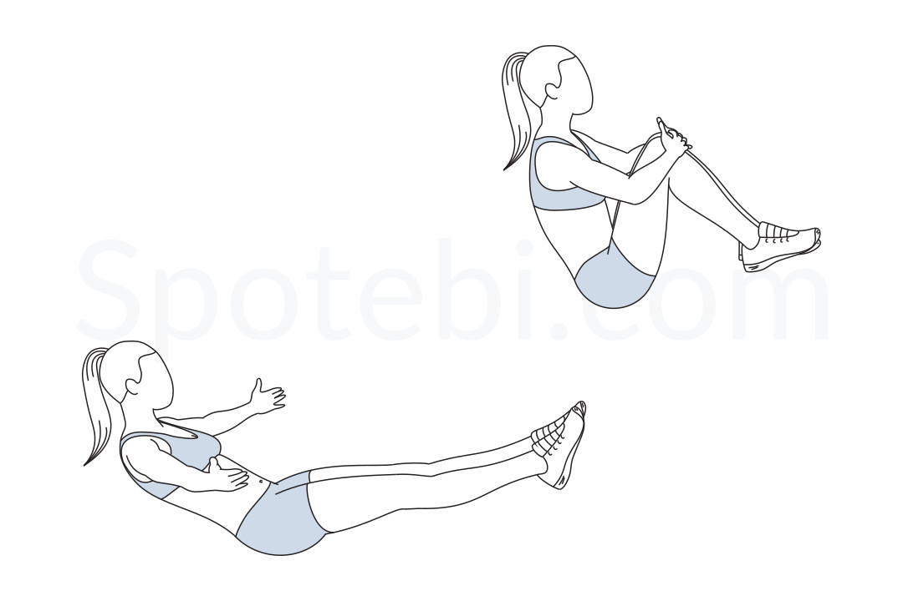        |
| **Plank Leg Lift**           | Go to plank, lift legs alternating.               | 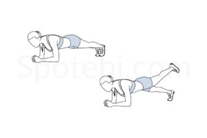 |

---

### Break
Either have a break (1 min), or if weather is too cold: do jumping jacks.

---

## Round 2: Core and Unilateral Strength

| Exercise                     | Description                                       | Image                                                   |
| ---------------------------- | ------------------------------------------------- | ------------------------------------------------------- |
| **Skater**                   | Touch floor with hand                             | 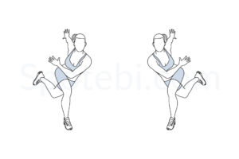          |
| **Bicycle Crunches**         | Tap knee with elbow, alternating sides            | 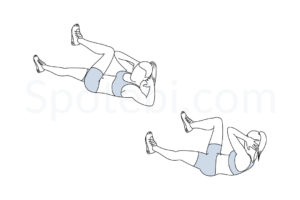 |
| **Side Plank Rotations**     | Side plank; extend arm; switch side after 20s     | 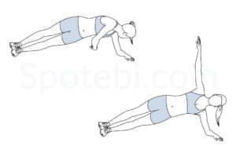 |

---

## Round 3: Core Burnout and Mobility

| Exercise                     | Description                                       | Image                                                   |
| ---------------------------- | ------------------------------------------------- | ------------------------------------------------------- |
| **Superman Twist**           | Superman position, hands to ears, turn head and shoulders | 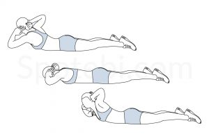 |
| **Double Pulse Squat Jump**  | Pulse 2 squats, then jump                         | 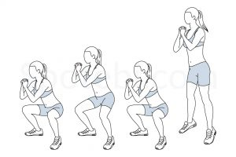 |
| **Elbow Squeeze Shoulder Press** | 2 moves                                      | 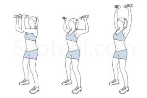 |

---

## Round 4: Plank Challenge

| Exercise                     | Description                                       | Image                                                   |
| ---------------------------- | ------------------------------------------------- | ------------------------------------------------------- |
| **Plank**                    | Hold for 1 min                                    | 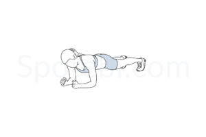            |

---

## Timing Summary
1. **Each exercise:** 45 seconds work, 10 seconds rest.
2. **Each round:** 3 exercises × 3 sets = 8.25 minutes per round.
3. **Break:** 1 min after each round.
4. **Total workout time (including breaks):** ~27 minutes.

---

