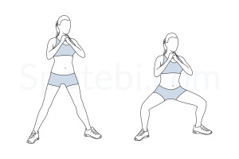
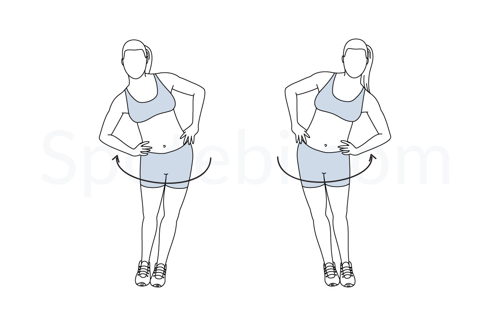
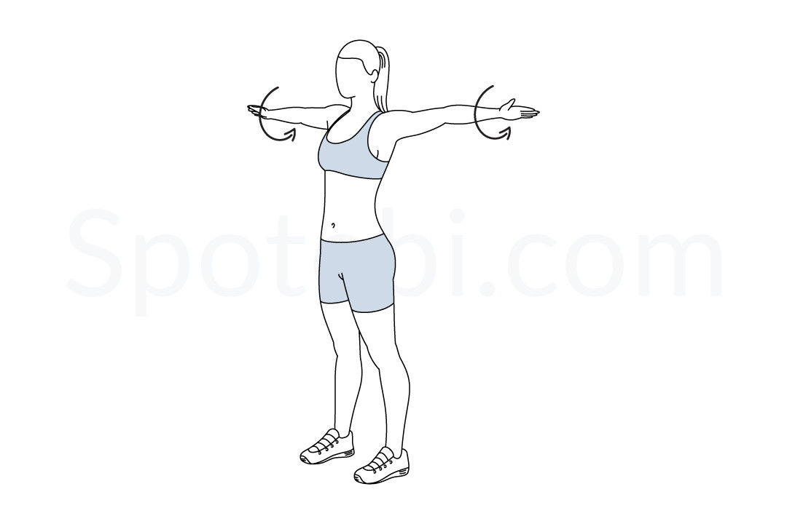
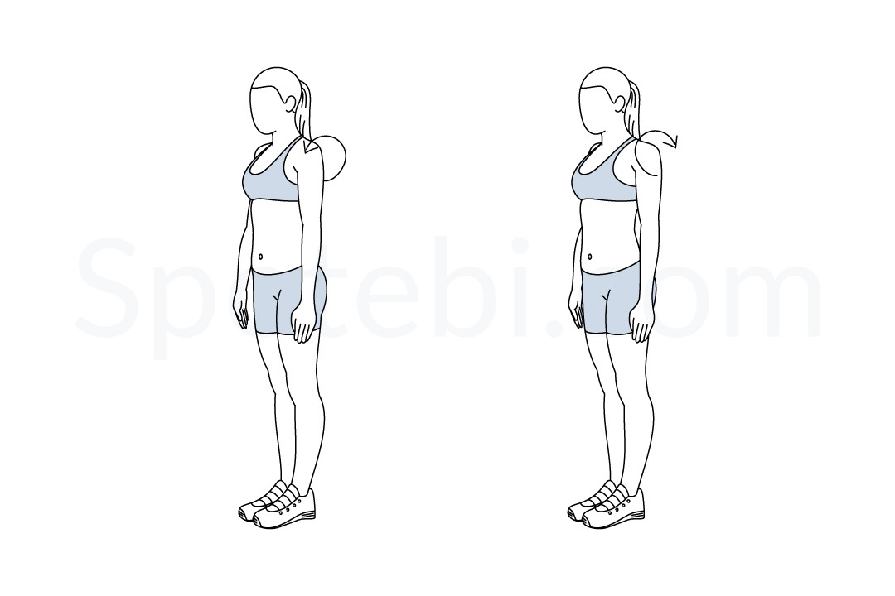
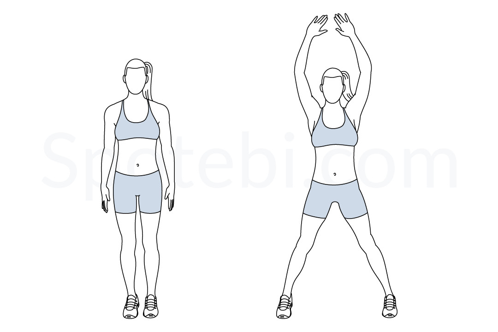

# Full-Body 3x3x3 Workout Plan

## Round 1: Lower Body and Posture

| Exercise                     | Description                                       | Image                                                   |
| ---------------------------- | ------------------------------------------------- | ------------------------------------------------------- |
| **Knee Hugs**                | Bring one knee to the chest while balancing on the other leg, alternating sides. |  |
| **Bent Over Lateral Raise**  | Hinge at the hips, lift arms out to the sides while keeping a slight bend in the elbows. |  |
| **Sumo Squats**              | Stand with feet wide, toes pointing slightly outward, squat down, keeping chest lifted. |  |

---

## Round 2: Core and Upper Body Strength

| Exercise                     | Description                                       | Image                                                   |
| ---------------------------- | ------------------------------------------------- | ------------------------------------------------------- |
| **Bicycle Crunches**         | Lie on your back, twist elbow to opposite knee, alternating sides. |  |
| **Superman Twist**           | Lift chest and legs off the ground, twisting torso side to side. |  |
| **One Arm Tricep Push-Up**   | From a side-lying position, push yourself up using one arm. |  |

---

## Round 3: Core and Lower Body Activation

| Exercise                     | Description                                       | Image                                                   |
| ---------------------------- | ------------------------------------------------- | ------------------------------------------------------- |
| **Glute Bridge**             | With extended legs, lift one leg, lower, then switch sides. |  |
| **Biceps Curl**         | Biceps curl |  |
| **Side Leg Lifts**           | Lie on your side, lift top leg upwards, then lower in a controlled manner. |  |

---

## Plank Challenge

2 min Plank

---

## Timing Summary
1. **Each exercise:** 45 seconds work, 10 seconds rest.
2. **Each round:** 3 exercises × 3 sets = 8.25 minutes per round.
3. **Break:** 1 minute after each round.
4. **Total workout time (including breaks):** ~27 minutes.

---

This full-body workout balances lower-body strength, core stability, and upper-body endurance. Enjoy your session!

---

## Instructions
- Perform **3 exercises** per round.
- Complete each exercise for **45 seconds**, followed by a **10-second rest**.
- Repeat each round **3 times**.
- Take a **1-minute rest** between rounds.

- Spotify: CrossFIT Music (Hits 2025 and Classics)

---

## Warm Up

| Exercise                     | Description                                       | Image                                                   |
| ---------------------------- | ------------------------------------------------- | ------------------------------------------------------- |
| **Hip Circles**              | Warm up hips                                       |  |
| **Arm Circles**              | Circle arms, start small, grow larger; switch side  |  |
| **Bent Over Twist**          | Start, go to one foot, up, then to the other       |  |
| **Shoulder Rolls**           | Warm up shoulders                                  |  |
| **High Knees**               | Run in place, driving knees as high as possible.   |  |
| **Jumping Jacks**               |    |   |

---