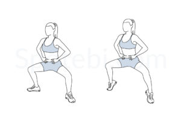

# Tabata 3x3x3 Workout (Ankle-Friendly)

## Instructions
- Perform **3 exercises per round**.
- Each exercise lasts **45 seconds**, followed by a **10-second rest**.
- Repeat each round **3 times** before moving to the next.
- Take a **1-minute rest** between rounds.

---

## Round 1: Upper Body and Core Activation

| Exercise                     | Description                                       | Image                                                   |
| ---------------------------- | ------------------------------------------------- | ------------------------------------------------------- |
| **Around the world - standing** | Hold dumbbells over your head and slowly rotate them in a circular motion around your head, keeping your arms extended. |  |
| **Core Twists**           | Sit on the floor with your knees bent and feet flat. Rotate your torso from side to side, engaging your core. Optionally hold a dumbbell for added resistance. |  |
| **Plie Squat Calf Raise** | Stand with feet wider than shoulder-width, toes pointed outward. Lower into a squat, then rise onto your toes before lowering your heels back down. |  |

---

## Round 2: Core and Stability

| Exercise                     | Description                                       | Image                                                   |
| ---------------------------- | ------------------------------------------------- | ------------------------------------------------------- |
| **Inner Thigh Lift**      | Lie on your side, keep the bottom leg extended, and lift it upward while engaging your inner thigh muscles. Slowly lower and repeat before switching sides. |  |
| **Dead Bug**                 | Lie on your back, lift both arms and legs. Extend one arm and the opposite leg toward the floor while keeping your core engaged. Return to the start and alternate sides. |  |
| **One Arm Tricep Push-Up**   | Lie on your side with one arm placed in front of your chest. Push up using the arm while keeping the other hand on your side. Lower back down with control. |  |

---

## Round 3: Core Burnout and Strength

| Exercise                     | Description                                       | Image                                                   |
| ---------------------------- | ------------------------------------------------- | ------------------------------------------------------- |
| **Crunches**           | Lie on your back with knees bent and feet flat on the floor. Engage your core and lift your upper body toward your knees while keeping your lower back grounded. Lower back down with control. |  |
| **Chest Fly**         | Lie on your back holding dumbbells in both hands, arms extended above your chest. Slowly lower the dumbbells outward, keeping a slight bend in your elbows, then return to the start position. |  |
| **Push-Up**         | Start in a high plank position with hands shoulder-width apart. Lower your chest toward the ground while keeping your body straight, then push back up to the starting position. |  |

---

## Timing Summary
1. **Each exercise:** 45 seconds work, 10 seconds rest.
2. **Each round:** 3 exercises × 3 sets = ~9 minutes per round.
3. **Break:** 1-minute rest after each round.
4. **Total workout time (including breaks):** ~30–35 minutes.

---

### Key Features:
- **Ankle-friendly exercises** that focus on core, upper body, and controlled lower-body movements.
- **Balanced full-body workout** including core activation, strength, and endurance training.
- **Minimal impact** with no excessive jumping or rapid lateral movements.
