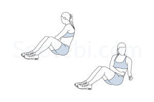
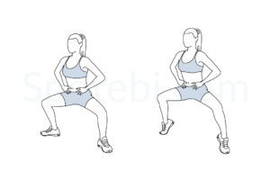
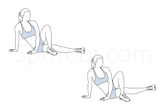
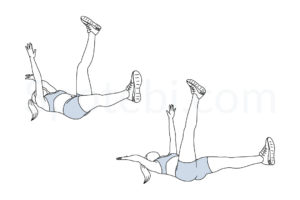
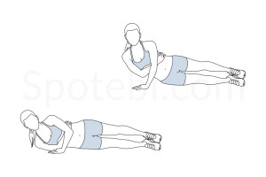
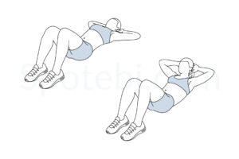
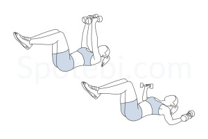
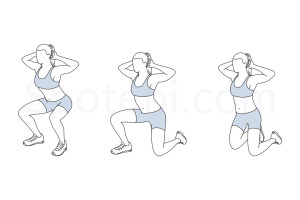

# Tabata 3x3x3 Workout

## Instructions
- Perform **3 exercises per round**.
- Each exercise lasts **45 seconds**, followed by a **10-second rest**.
- Repeat each round **3 times** before moving to the next.
- Take a **1-minute rest** between rounds.

---

## Round 1: Upper Body and Core Activation

| Exercise                     | Description                                       | Image                                                   |
| ---------------------------- | ------------------------------------------------- | ------------------------------------------------------- |
| **Around the world - standing** | Hold dumbbells overhead and rotate them in a circular motion. |  |
| **Core Twists**           | Sit with feet flat, twist torso side to side. Optionally hold a weight. |  |
| **Plie Squat Calf Raise** | Squat with feet wide, then rise onto toes before lowering. |  |

---

## Round 2: Core and Stability

| Exercise                     | Description                                       | Image                                                   |
| ---------------------------- | ------------------------------------------------- | ------------------------------------------------------- |
| **Inner Thigh Lift**      | Lie on your side, lift the bottom leg up, and lower slowly. |  |
| **Dead Bug**                 | Lie on your back, extend one arm and opposite leg, then switch. |  |
| **One Arm Tricep Push-Up**   | Lie on your side, push up using one arm, then lower. |  |

---

## Round 3: Core Burnout and Strength

| Exercise                     | Description                                       | Image                                                   |
| ---------------------------- | ------------------------------------------------- | ------------------------------------------------------- |
| **Crunches**           | Lie on your back, lift shoulders off the floor, then lower. |  |
| **Chest Fly**         | Lying down, lower dumbbells outward, then return to start. |  |
| **Push-Up**         | Lower your chest to the floor, then push back up. |  |
| **Hostage**         | (optionally) |  |

---

## Timing Summary
1. **Each exercise:** 45 seconds work, 10 seconds rest.
2. **Each round:** 3 exercises × 3 sets = ~9 minutes per round.
3. **Break:** 1-minute rest after each round.
4. **Total workout time (including breaks):** ~30 minutes.

