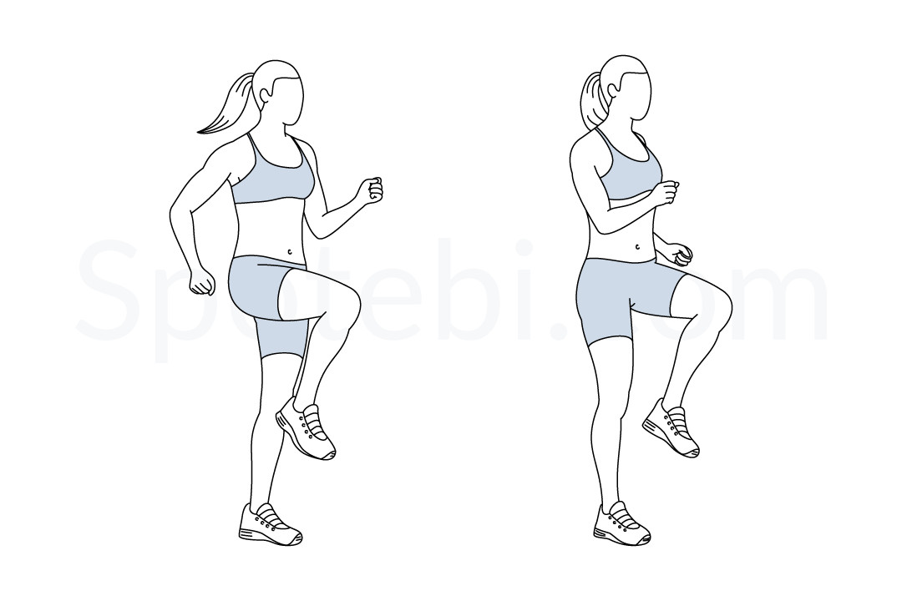
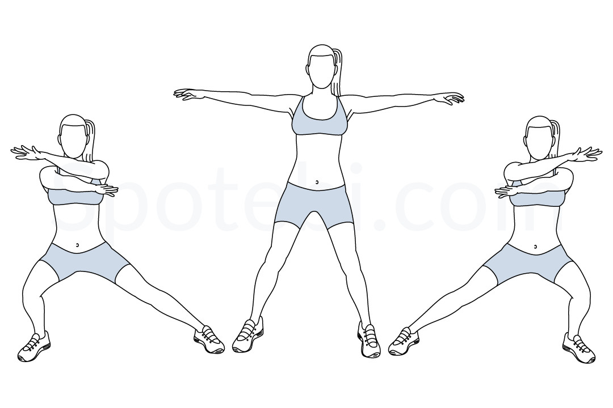
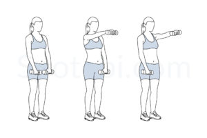

# Full-Body 3x3 Workout – No Mat Needed

## Instructions
- Perform **3 exercises per round**.
- Each exercise lasts **45 seconds**, followed by a **10-second rest**.
- Repeat each round **3 times** before moving to the next.
- Take a **1-minute break** between rounds.
- No mat or floor exercises required!

---
## Warmup

- Jumping Jack
- Beine nach aussen drehen
- im Kreis rennen & abwechselnd Übungen
- Bent over twist

---

## Round 1: Warm-Up & Core Activation

| Exercise                     | Description                                       | Image                                                   |
| ---------------------------- | ------------------------------------------------- | ------------------------------------------------------- |
| **Run and Stop**             | Run 3m, stop, run back, stop, repeat.           |  |
| **Balance Chop**| Hold dumpbell like a chopper, lift knee and twist torso. |  |
| **Bent Over Lateral Raise**  | Hinge forward and raise arms out to the sides.    |  |

---

## Round 2: Core and Power

| Exercise                         | Description                                               | Image                                                   |
| -------------------------------- | --------------------------------------------------------- | ------------------------------------------------------- |
| **Skater**                       | Hop side to side, crossing the rear leg behind.           |  |
| **Alternating Plank Row Leg Raise** | Row one arm while lifting the opposite leg, alternating sides. |  |
| **Twist Punches**                | Punch across your body, twisting the torso with each rep. |  |

---

## Round 3: Strength and Burn

| Exercise                     | Description                                       | Image                                                   |
| ---------------------------- | ------------------------------------------------- | ------------------------------------------------------- |
| **arms-cross-side-lunge** | Side lunge, cross arms.    |  |
| **Dumbbell Front Raise**     | Raise dumbbells forward to shoulder height.       |  |
| **Standing Crunches**        | Pull arms down while lifting knees toward the chest. |  (standing)|

---

## Timing Summary
1. **Each exercise:** 45 seconds work, 15 seconds rest  
2. **Each round:** 3 exercises × 3 sets = ~9 minutes  
3. **Breaks:** 1-minute between rounds  
4. **Total workout time:** ~30–35 minutes

