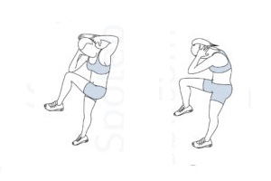

# Full-Body 3x9 Workout 

| **Instructions**                                                                                       | **Timing Summary**                                                                               |
| ------------------------------------------------------------------------------------------------------ | ------------------------------------------------------------------------------------------------ |
| - 3 rounds of 9 exercises each    - 1 minute per exercise   - 15 seconds rest between exercises   - 1 minute break between rounds   - Full-body, no equipment required | - Each round = 9 min work + ~2 min breaks   - Total time ≈ 35–40 minutes   - Format: 1 min ON / 15 sec OFF   - High intensity, full-body focus |

---

## Exercises - 3 rounds

| Exercise                     | Description                                       | Image                                                   |
| ---------------------------- | ------------------------------------------------- | ------------------------------------------------------- |
| **Run & Stop**              | Run 3m, touch floor, run back, touch floor, repeat |  |
| **Bent Over Lateral Raise** | Hinge at the hips, raise arms to the side, squeeze shoulders. |  |
| **Standing Crunches**       | Raise knee to chest while pulling arms down to engage core. |  |
| **Burpees**| Burpees with pushup and jumps |  |
| **Plank Hip Dips**          | In plank position, rotate hips side-to-side. Great for obliques. |  |
| **Lunges with Weights**     | Step forward and lower into a lunge while holding dumbbells. |  |
| **Butterfly Sit-Ups**       | Soles together, sit up fully with a wide knee position. |  |
| **One Arm Tricep Push-Up**  | Lie on side, push body up with one arm. Targets triceps. |  |
| **Donkey Kick Twist**       | Kick back and up while twisting knee across body. |  |

