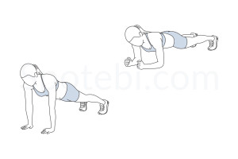
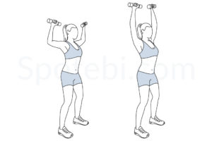
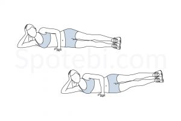
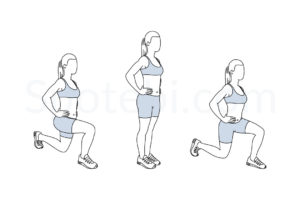
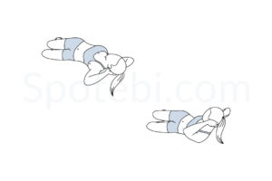

# 💪 3x9 Full-Body Workout

## Instructions & Timing

| **Instructions**                                                                                       | **Timing Summary**                                                                               |
| ------------------------------------------------------------------------------------------------------ | ------------------------------------------------------------------------------------------------ |
| - 3 rounds of the same 9 exercises    - 1 minute per exercise   - 15 seconds rest between exercises   - 1 minute break between rounds   - Full-body workout | - 9 min work per round   - +2 min breaks per round ≈ 11 min total/round   - Total time ≈ 33–35 minutes   - Great balance of strength, core, and mobility |

---

## 🔁 Round (Repeat 3x)

| Exercise                     | Description                                       | Image                                                   |
| ---------------------------- | ------------------------------------------------- | ------------------------------------------------------- |
| **One Arm Tricep Push-Up**   | Lie on your side and push yourself up with one arm. |  |
| **Hostage**                  | Pull shoulder blades back and down with arms raised. |  |
| **Commando**                 | Switch between forearm and high plank positions. |  |
| **Dumbbell Shoulder Press**  | Press dumbbells overhead from shoulder height.   |  |
| **Side Leg Lifts**           | Lie on side and lift top leg to hip height, then lower. |  |
| **Forward Lunges**           | Step forward and lower into a lunge, switch legs. |  |
| **Side Crunch**              | Lie on your side and crunch torso upward.         |  |
| **Push-Ups**                 | Lower chest to floor, then push back up.          |  |
| **Bicycle Crunches**          | alternating sides |  |

---

> 🔁 **Repeat this round 3 times** for a complete session.
