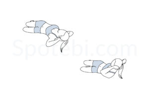

# Exercise Table

| Exercise Name                | Target Muscle Group    | Image                                                     |
| ---------------------------- | ---------------------- | --------------------------------------------------------- |
| Alternating Plank Row Leg Raise | Abs, Arms, Legs        |  |
| Elbow Squeeze Shoulder Press  | Arms                  |  |
| Scissor Kicks                 | Abs                   |                |
| Alternating Superman          | Abs, Arms             |  |
| Flutter Kicks                 | Abs                   |                |
| Side Crunch                   | Abs                   |                    |
| Ankle Tap Push-Ups            | Abs, Arms             |      |
| Frog Bridge                   | Legs                  |                    |
| Side Leg Lifts                | Legs                  |              |
| Around the Worlds             | Abs, Arms             |        |
| Front and Back Lunges         | Legs                  |  |
| Side Lunge                    | Legs                  |                      |
