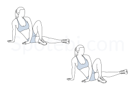
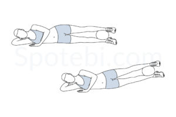
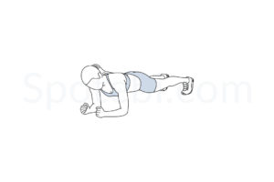
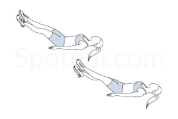
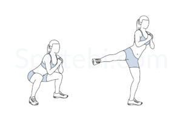
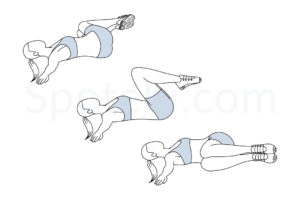
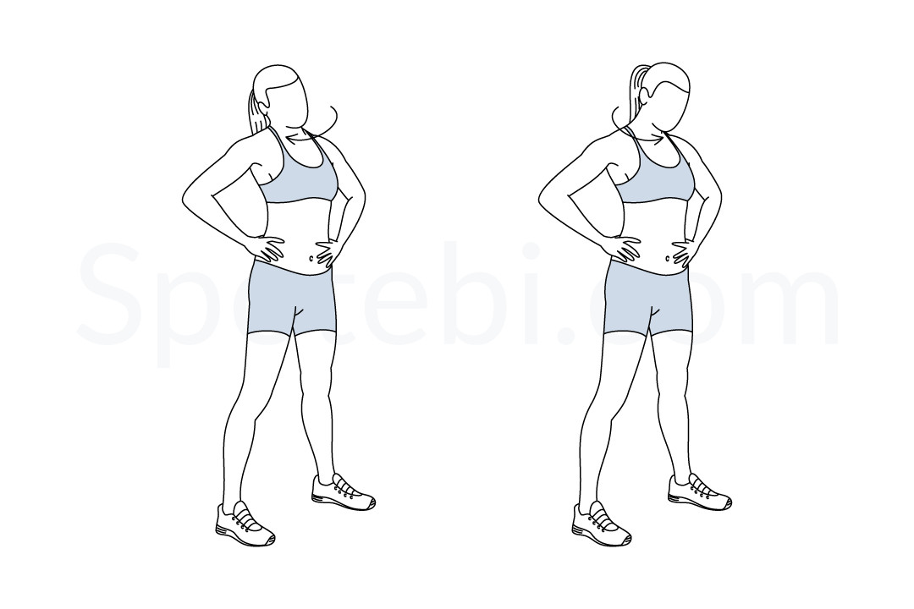

# Exercise Table
https://www.spotebi.com/exercise-guide/

| Exercise Name                | Target Muscle Group    | Image                                                     |
| ---------------------------- | ---------------------- | --------------------------------------------------------- |
| Alternating Plank Row Leg Raise | Abs, Arms, Legs        |  |
| Alternating Superman          | Abs, Arms             |  |
| Ankle Tap Push-Ups            | Abs, Arms             |      |
| Arms Cross Side Lunge            | Abs, Arms             |      |
| Around the Worlds             | Abs, Arms             |        |
| Bent Over Lateral Raise       | Arms                  |  |
| Bent Over Row Dumbbell        | Arms                  |  |
| Biceps Curl                   | Arms                  |                    |
| Bicycle Crunches              | Abs                   |          |
| Bird Dog | Back                  |  squeeze|
| Boat Twist                    | Abs                   |                      |
| **Balance Chop**| Hold dumpbell like a chopper, lift knee and twist torso. |  |
| **Twist Punches**                | Punch across your body, twisting the torso with each rep. |  |
| Breakdancer                   | Abs, Arms             |                    |
| Burpees                       | Abs, Arms, Legs       |                            |
| Chest Fly                     | Arms, Chest           |                        |
| Commando                      | Abs, Arms             |                          |
| Cross Crunches                | Abs                   |              |
| Crunches                      | Abs                   |                          |
| Dead Bug                      | Abs                   |                          |
| Decline Push-Up               | Arms, Chest           |            |
| Donkey Kick Twist             | Abs, Legs             |        |
| Donkey Kicks                  | Legs                  |                  |
| Double Pulse Squat Jump       | Legs                  |  |
| Dumbbell Chest Press          | Arms, Chest           |  |
| Dumbbell Front Raise          | Arms                  |  |
| Dumbbell Lateral Raise        | Arms                  |  |
| Dumbbell Shoulder Press       | Arms                  |  |
| Elbow Squeeze Shoulder Press  | Arms                  |  |
| Flutter Kicks                 | Abs                   |                |
| Frog Bridge                   | Legs                  |                    |
| Front and Back Lunges         | Legs                  |  |
| Glute Bridge                  | Legs                  |                  |
| Hammer Curls                  | Arms                  |                  |
| High Kicks                    | Legs, Abs             |                      |
| Hostage                       | Abs, Legs             |                            |
|Inner Thigh Lift|Legs| foot flexed | 
| Inner Thigh Squeeze and Lift  | Legs                  |  both legs, squeeze|
| Knee to Elbow Kickback        | Abs, Legs             |  |
| Knee Hugs        | Abs, Legs             |  |
| Lunge Front Kick              | Legs                  |          |
| Mountain Climber Twist        | Abs, Legs             |  |
| Mountain Climbers             | Abs, Arms, Legs       |        |
| Oblique Crunch                | Abs                   |              |
| One Arm Tricep Push-Up        | Arms                  |  |
| Plank Hip Dips                | Abs                   |              |
| Plank Jacks                   | Abs, Legs             |                    |
| Plank Leg Lifts               | Abs, Legs             |            |
| Plank Rotation                | Abs, Arms             |              |
| Plank Shoulder Tap            | Abs, Arms             |      |
| Plank                         | Abs, Arms             |                                |
| Plie Squat Calf Raise         | Legs                  |  |
| Push-Up                       | Arms, Chest           |                            |
| Core Twist                 | Abs                   |                |
| Scissor Kicks                 | Abs                   |                |
| Side Crunch                   | Abs                   |                    |
| Side Leg Lifts                | Legs                  |              |
| Side Lunge                    | Legs                  |                      |
| Side Lunge Curl               | Legs, Arms                  |                      |
| Side Plank Hip Lifts          | Abs                   |  |
| Side Plank Rotation           | Abs                   |    |
| Side Plank                    | Abs                   |                      |
| Single Leg Bridge             | Legs                  |        |
| Single Leg Tricep Dips        | Arms                  |  |
| Sit-Up                        | Abs                   |                              |
| Skaters                       | Legs, Abs             |                            |
| Spiderman Plank               | Abs, Arms, Legs       |            |
| Squat Side Kick               | Legs                  |            |
| Squat                         | Legs                  |                                |
| Step-Up with Knee Raise       | Legs                  |  |
| Straight Leg Raise            | Abs                   |      |
| Sumo Squat                    | Legs                  |                      |
| Superman Twist                | Abs, Arms             |              |
| Superman                      | Abs, Arms, Back       |                          |
| Toe Touch                     | Abs                   |                        |
| Tricep Dips                   | Arms                  |                    |
| V-Sit Bicycles                | Abs                   |              |
| Windshield Wipers             | Abs                   |        |

# Warmup

| Exercise Name                | Target Muscle Group    | Image                                                     |
| ---------------------------- | ---------------------- | --------------------------------------------------------- |
| Arm Circles |         |  |
| Bent Over Twist |         |  |
| High Knees |        |  |
| Hip Circles |        |  |
| Jumping Jacks          | |              |
| Neck Rolls |        |  |
| Run In Place |        |  |
| Shoulder Rolls |        |  |